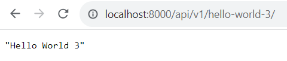

# Announcement service

The "Announcement Service" is a platform for creating, managing, and sharing announcements with a two-tier message system. Users can perform CRUD operations on both local announcements, accessible only to users within the same location, and public announcements, visible to everyone, including non-service users. Providing a flexible solution for personalized and community-wide communication, this platform ensures efficient information sharing on both local and global scales.

## 🪄Main Features

1. **Create Announcement:**
    - Users can create announcements of two types: local and public.

2. **View Announcements via Link:**
    - You can easily share each announcement with others using a special link, making it simple for everyone to access and spread the word.

3. **Edit Announcements:**
    - Users can change what they wrote in their announcements whenever they want.

4. **Delete Announcements:**
    - Users can delete their own announcements.

## 🔮Getting Started  
To run the Announcement Service locally, follow these steps:  

+ **Clone the Repository:**
    ``` 
   git clone https://github.com/Renatavl/django_project.git
    cd django_project 
    ```

+ **Create a virtual environment to install dependencies in and activate it:**
    ```
    virtualenv venv
    venv\Scripts\activate
    ```
+ **Install Dependencies:**
    ```
    pip install -r requirements.txt
    ```
+ **Run Migrations:**
    ```
    python manage.py migrate
    ```
+ **Start the Server:**
    ```
    python manage.py runserver 8051
    ```
+ **Access the Application:**
    ```
    Open your web browser and navigate to http://localhost:8000 to interact with Announcement Service.
    ```

## 🟣Usage Example
### Hello World API
To interact with the Hello World API, you can make HTTP GET requests to the following endpoint:
```http
GET /api/v1/hello-world-<variant_number>/
```
Replace <variant_number> with the desired variant number. This API endpoint will respond with a JSON message containing the greeting.

Example of using:

    http://127.0.0.1:8000/api/v1/hello-world-4/


<div align="center">
  
</div>


Replace 3 with the desired variant number.


    